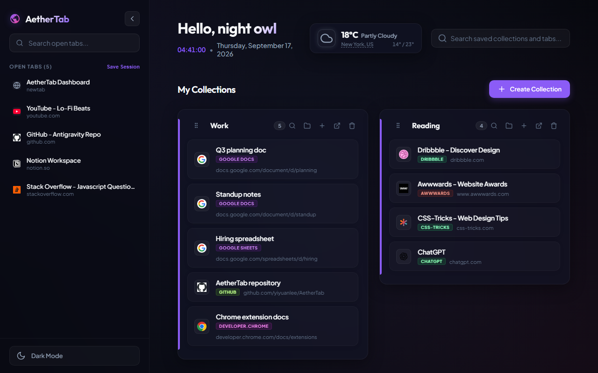

# AetherTab — Chrome Tab & Bookmark Manager

**Save your tabs. Organize your bookmarks. Open a calmer new tab.**

AetherTab is a Chrome extension that turns your new tab page into a visual workspace for tabs and bookmarks. Save open tabs into collections, import Chrome or Toby bookmarks, and return to your projects without keeping every page open. No separate AetherTab account is required.

**[Add to Chrome](https://chromewebstore.google.com/detail/aethertab/nnacnehbnklljafemehfhjekkoghfgok)** · [Official website](https://aethertab.com/) · [Watch the demo](https://aethertab.com/#demo) · [中文文档](README.zh-CN.md)

[](https://aethertab.com/#demo)

## See it in action

[Watch the AetherTab demo](https://aethertab.com/#demo) to see an open tab move into a collection. You can also [open the demo video directly](promo/aethertab-demo.mp4).

## What you can do

- **Save tabs and sessions.** Drag an open tab into a collection to save it and close the original tab, or use **Save Session** to save the current window.
- **Bring your bookmarks.** Import directly from Chrome, or use browser HTML exports, Toby JSON/TXT exports, and AetherTab share files.
- **Organize locally.** Preview categories and remove duplicate links before importing. Search collections, reorder saved links, and group pages by site.
- **Share a collection.** Export a share code or JSON file, or create a direct import link for another AetherTab installation.
- **Choose your workspace.** Switch between four accent themes and light or dark mode. Use keyboard shortcuts, undo delete, and an optional weather widget.
- **Enable Chrome Sync when needed.** Sync collections and preferences across browsers signed in to the same Chrome account.

## Get started

1. [Install AetherTab from the Chrome Web Store](https://chromewebstore.google.com/detail/aethertab/nnacnehbnklljafemehfhjekkoghfgok).
2. Open a new tab and create a collection for a project, reading list, or daily work.
3. Drag a tab from the sidebar into the collection, or select **Import** to bring in existing bookmarks.

For Toby imports, AetherTab supports both legacy lists/cards and newer spaces/collections/resources exports. Links and collection context are imported; Toby notes and tags are not.

## Your data

Collections and preferences are stored in Chrome storage. Bookmark parsing, categorization, and duplicate detection run on your device. Chrome Sync is optional; sharing a collection exports its name, link titles, and URLs. Weather requests use a city or location, and location permission is requested when you choose location-based weather.

See the [privacy policy](https://aethertab.com/privacy.html) for details.

## Development

```bash
npm install
npm test
npm run build
```

Open `chrome://extensions`, enable **Developer mode**, choose **Load unpacked**, and select this project folder. The extension uses ES modules and can run without a build step.

Open `newtab.html` outside extension mode for a visual preview with example data. Run `npm run test:preview` for the browser preview checks, or `npm run promo` to capture promotional assets.

Website files live in `docs/`; Chrome Web Store listing copy lives in `store/`.

## Feedback

[Report a bug or suggest a feature](https://github.com/yiyuanlee/AetherTab/issues). Include the steps to reproduce and your Chrome and AetherTab versions when reporting a problem.

## License

[MIT](LICENSE)
